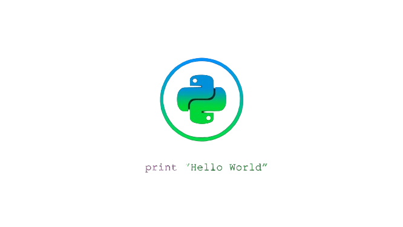
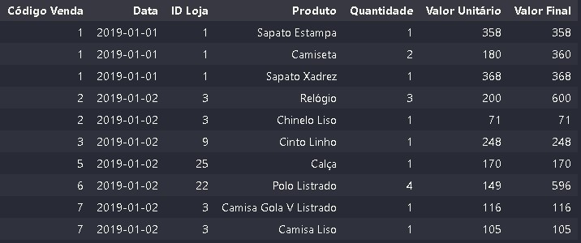

<h1>Desafio de Projeto:  Automação de Processos com Python 📈</h1>

 

# Criar um Projeto de Automação de Tarefas Rotineiras da Área Comercial

### Descrição:

Imagine que você trabalha em uma grande rede de lojas de roupa com 25 lojas espalhadas por todo o Brasil. 
Todo dia, pela manhã, a equipe de análise de dados calcula os chamados One Pages e envia-os para o gerente de cada loja, bem como todas as informações usadas no cálculo dos indicadores em uma página.
 Permitindo a comparação da meta vs realizado dos indicadores da loja, assim como quais indicadores aquela loja conseguiu cumprir ou não naquele dia.

### Objetivo: 
Automação do processo de cálculo dos indicadores de vendas e o envio da análise para cada loja em um ONEPAGE e seu respectivo arquivo anexo.

### Estrutura do Repositório:
- <b> Backup Arquivos Lojas: </b> Este diretório foi criado durante o processo de análise para arquivar as planilhas com os resultados de cada loja.
- <b> Bases de Dados: </b> Neste diretório encontram-se um arquivo .csv e dois arquivos em .xlsx utilizados para análise.
- <b> Código: </b> Neste diretório contém o notebook Jupyter onde a análise foi realizada e os resultados obtidos.
- <b> Imagens: </b> Neste diretório contém as imagens e ilustrações utilizadas na documentação.

### Indicadores a Serem Calculados no OnePage

<b>Faturamento -> </b>
- Metas vs Resultados em R$ do Dia e no Ano
- Meta Ano: R$ 1.650.000
- Meta Dia: R$ 1.000

<b>Diversidade de Produtos -> </b>
- Quantidade de produtos diferentes vendidos no período 
- Metas e Resultados de vendas do Dia e Ano 
- Meta Ano: 120
- Meta Dia: 4

<b>Ticket Médio -> </b> 
- Metas e Resultados do Ticket Médio em R$ do Dia e Ano
- Meta Ano: R$ 500
- Meta Dia: R$ 500

Observações: 
 
- Cada indicador DIA foi calculado no último dia do ano disponível na planilha de Vendas (a data mais recente)

#
### Linguagem Utilizada:

### Bibliotecas Utilizadas:

## Etapas do Projeto
1. <b>Preparação dos Dados: </b>

 
    <h5 align = "center"> 
        
        
 <strong>Amostra:</strong> Base Vendas.

    </h5>

### Backup da análise

A partir da análise realizada de cada loja foi criado uma planilha e uma pasta da loja correspondente para backup, organização e controle. 

<h4  >
    
Criação de Backup da planilha criada para loja  

    
</h4>

### Envio do ONEPAGE
Concluímos o projeto realizando o envio do resultado para os respectivos gerentes e um Ranking das melhores e piores lojas em desempenho para o diretor da empresa.

Projeto finalizado com o envio do resultado para as 25 lojas.

