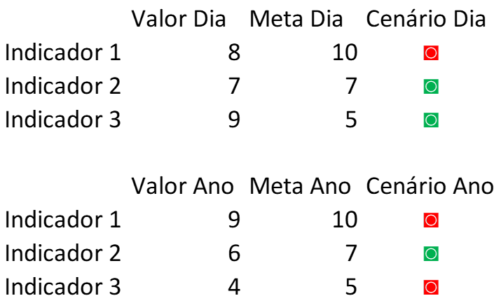

<h1 align = "center"> 
    
    
 Automação de Indicadores com Python 📈

</h1>

### Objetivo: 
Automatização do processo de cálculo dos indicadores de vendas e o envio da análise para cada loja em um ONEPAGE e seu respectivo arquivo anexo.

### Estrutura do Repositório:
- <b> Backup Aruivos Lojas: </b> Este diretório foi criado durante o processo de análise para arquivar as planilhas com os resultados de cada loja.
- <b> Bases de Dados: </b> Neste diretório encontram-se um arquivo .csv e dois arquivos em .xlsx utilizados para análise.
- <b> Código: </b> Neste diretório contém o notebook Jupyter onde a análise foi realizada e os resultados obtidos.

### Linguagem Utilizada:

### Bibliotecas Utilizadas:

- Pandas
- Pathlib
- Win32com

### Descrição:

Imagine que você trabalha em uma grande rede de lojas de roupa com 25 lojas espalhadas por todo o Brasil.

Todo dia, pela manhã, a equipe de análise de dados calcula os chamados One Pages e envia os para o gerente de cada loja, bem como todas as informações usadas no cálculo dos indicadores em uma página.

 Permitindo a comparação entre as diferentes lojas, assim como quais indicadores aquela loja conseguiu cumprir ou não naquele dia.

<h2  >
    
Exemplo de OnePage: 

    
</h2>

### Indicadores a Serem Calculados no OnePage

Faturamento -> 
- Metas e Resultados em R$ do Dia e Ano
- Meta Ano: R$ 1.650.000
- Meta Dia: R$ 1.000

Diversidade de Produtos ->
- Quantidade de produtos diferentes vendidos no período 
- Metas e Resultados de vendas do Dia e Ano 
- Meta Ano: 120
- Meta Dia: 4

Ticket Médio -> 
- Metas e Resultados do Ticket Médio em R$ do Dia e Ano
- Meta Ano: R$ 500
- Meta Dia: R$ 500

Observações: 
 
- Cada indicador DIA foi calculado no último dia do ano disponível na planilha de Vendas (a data mais recente)

<h3>
    
Exemplo do Resultado do  ONEPAGE da Loja Shopping Eldorado  

    
</h3>

### Backup da análise

A partir da análise realizada de cada loja foi criado uma planilha e uma pasta da loja correspondente para backup, organização e controle. 

<h4  >
    
Criação de Backup da planilha criada para loja  

    
</h4>

### Envio do ONEPAGE
Concluímos o projeto realizando o envio do resultado para os respectivos gerentes e um Ranking das melhores e piores lojas em desempenho para o diretor da empresa.
<h5  >
    
Envio de ONE PAGE para os Gerentes   

    
</h5>

Projeto finalizado com o envio do resultado para as 25 lojas.

